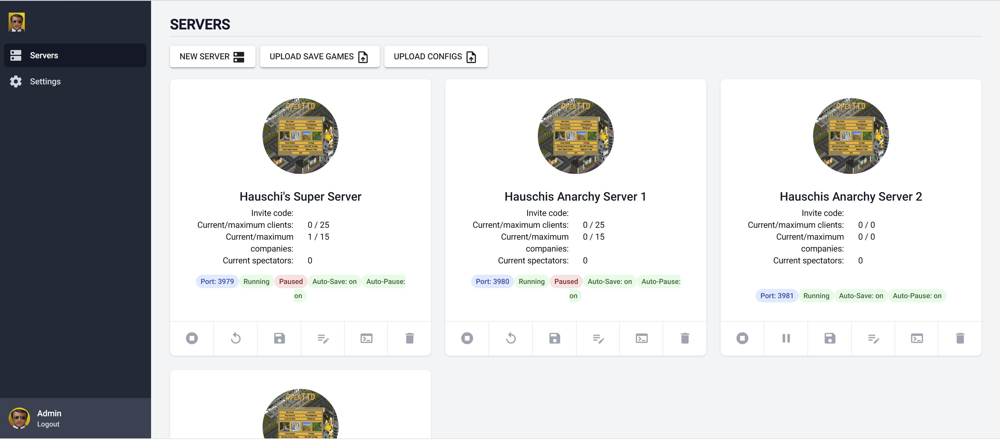
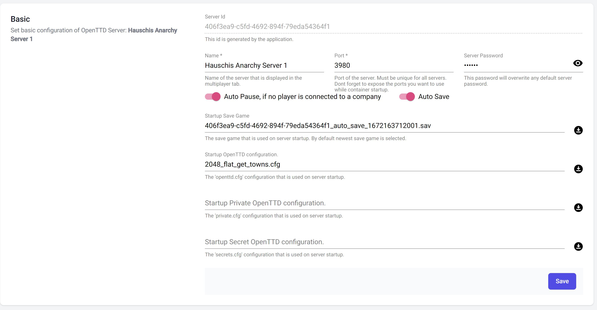
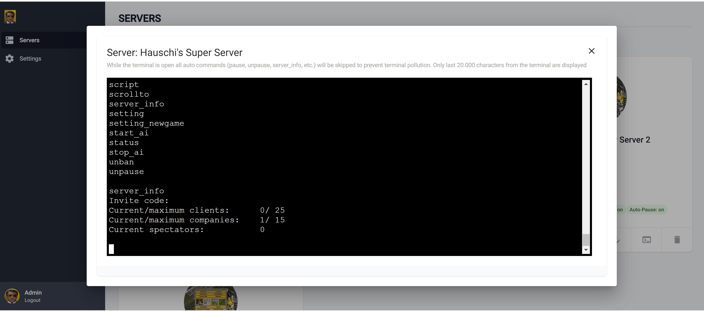
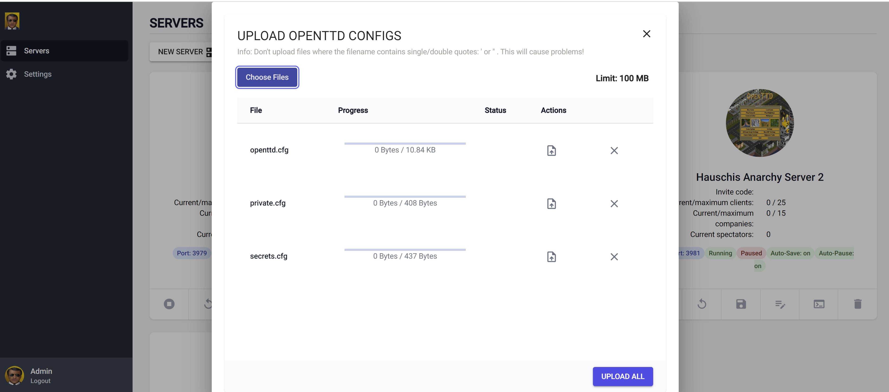
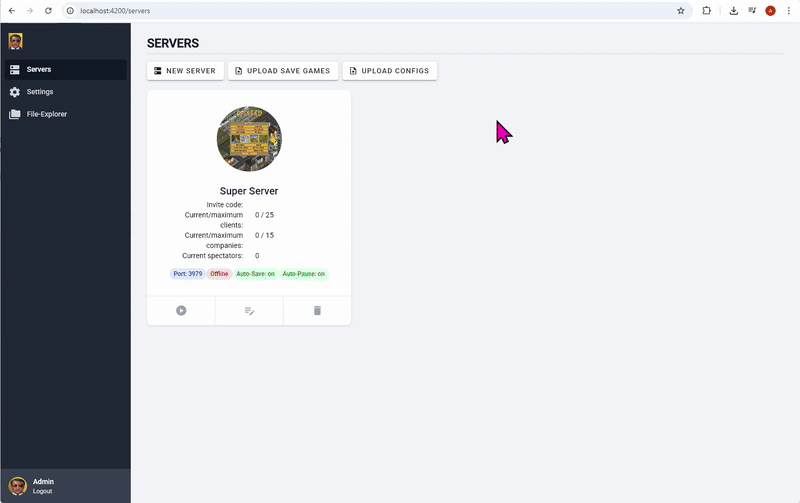
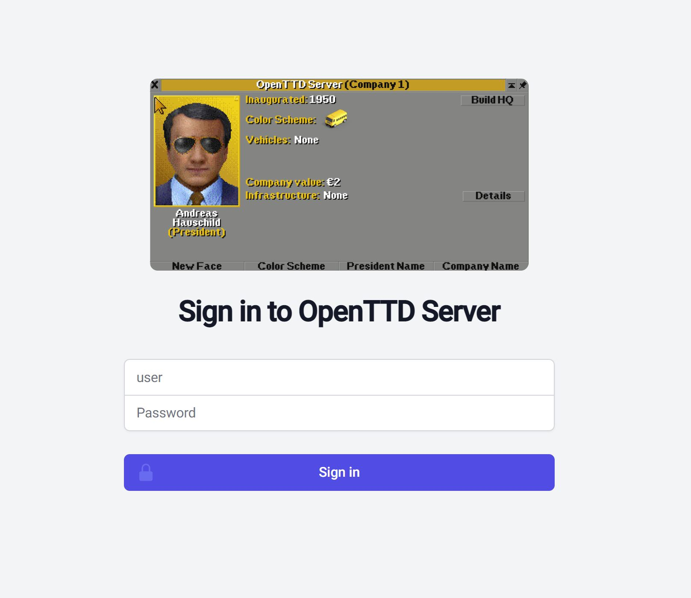

[](https://github.com/andreashauschild/openttd-server/actions/workflows/build.yml)
[](https://github.com/andreashauschild/openttd-server/actions/workflows/release.yml)  
[](https://hub.docker.com/r/hauschi86/openttd-server/)
[](https://hub.docker.com/r/hauschi86/openttd-server/)
[](https://hub.docker.com/r/hauschi86/openttd-server/)


# Welcome to OpenTTD Server
This Docker container allows you to host multiple instances of OpenTTD dedicated servers in a single container, providing an efficient and convenient environment for hosting these servers.

This documentation expect a basic knowledge of docker (expose ports and volumes).

The current state of this Project is `BETA`. Hosting works and every function was tested but as you know a developer should not test his own software. Please create an issue if something needs to be fixed.

It provides the following features:

- Login protected admin gui
- Managing multiple dedicated OpenTTD server instance. You just need to expose the needed ports on container startup.
- Upload/Download of save games and configuration files
- Password protection for dedicated servers
- Auto save of running servers
- Auto pause and unpause on inactive servers. If no player is playing the server is running but paused. Server unpauses if a player joins a company.
- Simple terminal to send commands directly to the dedicated server

# Versions
The following table shows which docker image contains which OpenTTD version. For now, I will only support final versions (no beta).

| Container                        | OpenTTD |
|----------------------------------|---------|
| hauschi86/openttd-server:latest  | 15.1    |
| hauschi86/openttd-server:v15.1.0 | 15.1    |
| hauschi86/openttd-server:v15.0.2 | 15.0    |
| hauschi86/openttd-server:v15.0.0 | 15.0    |
| hauschi86/openttd-server:v14.1.1 | 14.1    |
| hauschi86/openttd-server:v14.1.0 | 14.1    |
| hauschi86/openttd-server:v14.0.0 | 14.0    |
| hauschi86/openttd-server:v13.4.0 | 13.4    |
| hauschi86/openttd-server:v13.0.0 | 13.0    |
| hauschi86/openttd-server:v12.2.2 | 12.2    |


# Screenshots

### Server Management
<a href="docs/images/server-overview.JPG">

</a>

### Dedicated Server Settings
<a href="docs/images/server_configuration.JPG">

</a>

### Terminal
<a href="docs/images/server-terminal.JPG">

</a>

### File Upload
<a href="docs/images/file_upload.JPG">

</a>

### File Explorer for server customization like NewGRF etc.
<a href="docs/images/openttd-fileexplorer.gif">

</a>

### Admin Login
<a href="docs/images/admin-login.JPG">

</a>

### File Explorer
The File Explorer allows you to customize your OpenTTD installation at runtime by uploading custom content directly through the web interface. This feature was added based on [Issue #4](https://github.com/andreashauschild/openttd-server/issues/4).

#### Use Cases
- Upload **NewGRF** files to add new graphics, vehicles, industries, or town names
- Add **AI scripts** and **Game Scripts** to enhance gameplay
- Upload **Base Graphics Sets** for custom visual styles
- Manage configuration files and save games

#### How It Works
The File Explorer provides access to the OpenTTD installation directory (`/home/openttd/openttd-<version>`). You can:
- **Browse** the complete directory structure
- **Upload** files to any directory (e.g., `newgrf/`, `ai/`, `game/`)
- **Create** new directories for organizing content
- **Delete** files and directories
- **Download** files or entire directories as ZIP archives
- **Move/Copy** files between directories
- **Rename** files and directories

#### Example: Adding a NewGRF
1. Download the NewGRF using one of these methods:
   - **Via OpenTTD App:** Use the in-game content downloader. Files are saved to your local `content_download/newgrf` folder. See [OpenTTD Wiki](https://wiki.openttd.org/en/Manual/NewGRF#manual-install) for directory locations on your OS.
   - **Manual Download:** Get `.grf` files from [BaNaNaS](https://bananas.openttd.org/) or [GRFCrawler](https://grfcrawler.tt-forums.net/)
2. Open the File Explorer in the web interface
3. Navigate to the `newgrf/` directory
4. Upload the `.grf` file
5. Configure your server's `openttd.cfg` to use the NewGRF or create a save game that includes it

**Note:** NewGRF files should be installed before starting a new game to ensure correct operation. Changes to NewGRF settings are baked into save games.

# Networking
By default, docker does not expose the containers on your network. This must be done manually with -p parameter (see here for more details on -p). 
For the container to work you need to expose at least 2 ports. The port `8080` for the web application and the port for your openttd dedicated server (default: `3979`)

# File Locations
All data and uploads within the container are saved in the `/home/openttd/server` directory.
OpenTTD is installed on `/home/openttd/openttd-<version>` directory.

# Setup
When you start the Docker container for the OpenTTD server for the first time, it will log the password for the admin login. See fragment below.
You can use the admin user to log in to the web app, which runs on http://localhost:8080 by default.
Once logged in, you can access the web app's settings to change the admin password.

**First startup log fragment with password**
```
...
###########################################################################
### No initial password was set. A password for 'admin' will be generated.
### Copy it NOW, because it will never be shown again.
### Password: W!318Y-yBb
###########################################################################
...
```

# Examples
**Info:** If you have a specific version of the container that you prefer to use, you can replace the example version with your chosen version. 
This will ensure that you are using the version of the container that best meets your needs and preferences.

Run OpenTTD Server with 1 exposed port. In this case you can host only 1 server.

`docker run -d -p 8080:8080 -p 3979:3979/tcp -p 3979:3979/udp hauschi86/openttd-server:latest`

Run OpenTTD Server with 20 exposed port. In this case you can host 20 servers.

`docker run -d -p 8080:8080 -p 3979-3999:3979-3999/tcp -p 3979-3999:3979-3999/udp hauschi86/openttd-server:latest`

The container uses a simple file storage to store data. If you want to have persistent storage you should create a volume and bind it.

`docker run -d -v openttd-server-volume:/home/openttd/server -p 8080:8080 -p 3979-3999:3979-3999/tcp -p 3979-3999:3979-3999/udp hauschi86/openttd-server:latest`


# Usage Development Mode

## Quarkus remote docker container development
- Open a terminal in the `root` directory
- `docker build -f src/main/docker/Dockerfile . --progress=plain -t openttd-server`
- `docker run -i --rm -p 8080:8080 -p 5005:5005 -p 3977:3977/tcp -p 3979:3979/tcp -p 3979:3979/udp -e QUARKUS_LAUNCH_DEVMODE=true openttd-server`
- `openttd -D -b 8bpp-optimized`  Run with possibility to do screenshots (https://www.tt-forums.net/viewtopic.php?t=88943)
- https://quarkus.io/guides/maven-tooling#remote-development-mode
- https://blog.sebastian-daschner.com/entries/quarkus-remote-dev-in-containers-update

## Debug and develop in Quarkus Container:
- Quarkus debug url: http://localhost:8080/q
- Add properties to `application.properties`

```
quarkus.package.type=mutable-jar
quarkus.live-reload.password=Password_1
quarkus.live-reload.url=http://localhost:8080
```

- Add env values to dockerfile expose debug port and add remote debug to startup:

```
EXPOSE 5005
ENV QUARKUS_LAUNCH_DEVMODE=true
ENV JAVA_ENABLE_DEBUG=true

CMD ["java","-agentlib:jdwp=transport=dt_socket,server=y,suspend=n,address=0.0.0.0:5005", "-jar", "/deployments/quarkus-run.jar"]
```

- Start dev environment in remote debug mode (but disable local debug):
    - `mvn quarkus:remote-dev -Ddebug=false -Dquarkus.live-reload.url=http://localhost:8080`

## Helpful commands:

| Description                        | Command                                                                                   |
|------------------------------------|-------------------------------------------------------------------------------------------|
| Create Module with routing         | `npx ng g m HomeIndex --flat --routing`                                                   |
| Create Component and add to module | `npx ng g m LoginIndex --flat && npx ng g c LoginIndex --flat -m .\login-index.module.ts` |
|                                    |                                                                                           |
|                                    |                                                                                           |

## Structure Based on:

- https://github.com/joshuamorony/nx-angular-structure/tree/main/src/app
    - https://www.youtube.com/watch?v=7SDpTOLeqHE

