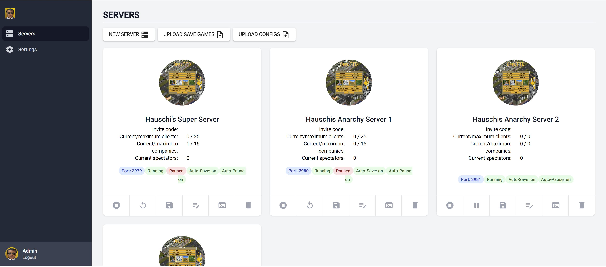
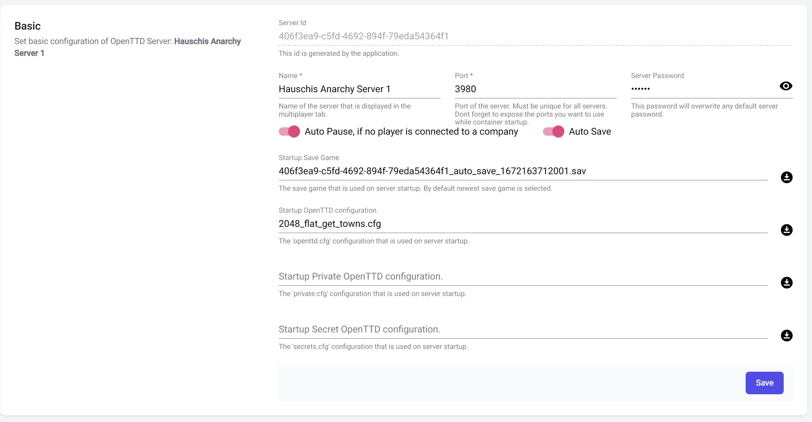
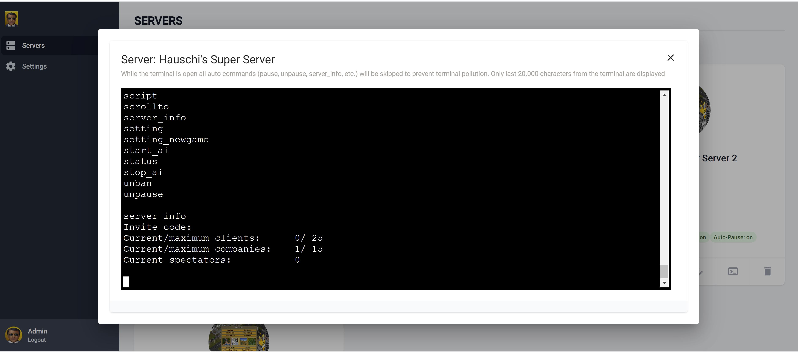
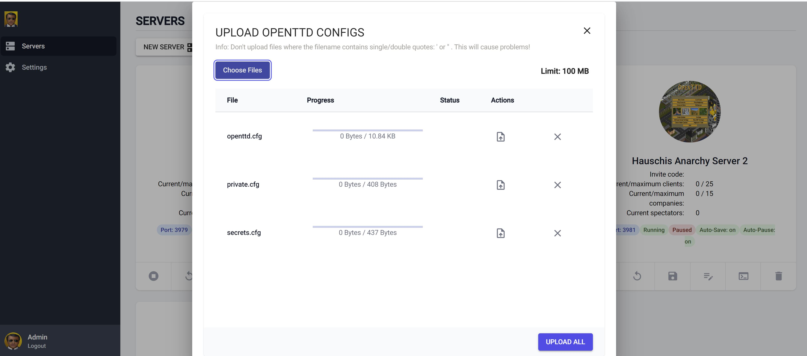
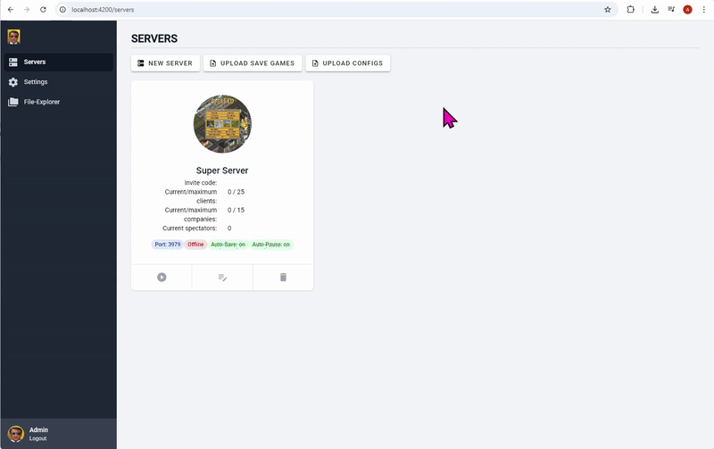
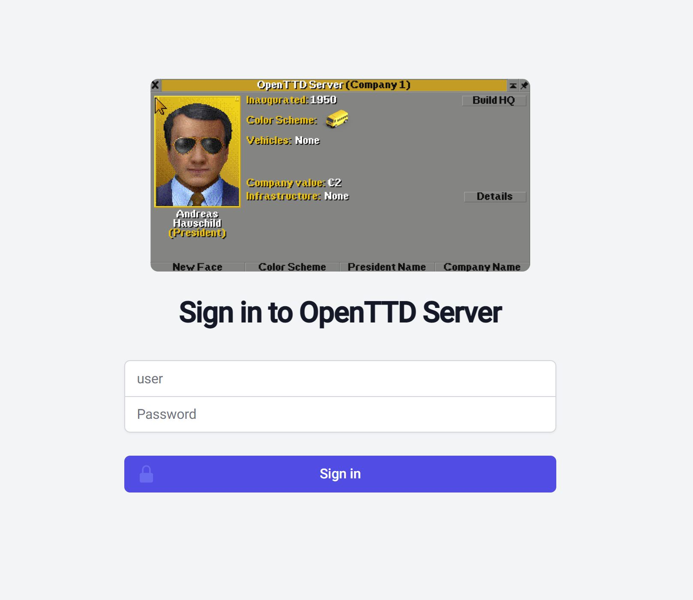

[](https://github.com/andreashauschild/openttd-server/actions/workflows/build.yml)
[](https://github.com/andreashauschild/openttd-server/actions/workflows/release.yml)  
[](https://hub.docker.com/r/hauschi86/openttd-server/)
[](https://hub.docker.com/r/hauschi86/openttd-server/)
[](https://hub.docker.com/r/hauschi86/openttd-server/)


# Welcome to OpenTTD Server
This Docker container allows you to host multiple instances of OpenTTD (https://www.openttd.org) dedicated servers in a single container, providing an efficient and convenient environment for hosting these servers.

This documentation expects a basic knowledge of docker (expose ports and volumes).

The current state of this Project is `BETA`. Hosting works and every function was tested but as you know a developer should not test his own software. Please create an issue if something needs to be fixed.

It provides the following features:

- Login protected admin gui
- Managing multiple dedicated OpenTTD server instances. You just need to expose the needed ports on container startup.
- Upload/Download of save games and configuration files
- File Explorer for the OpenTTD installation (NewGRF, AI and game scripts, base sets), see [File Explorer](#file-explorer)
- Password protection for dedicated servers
- Auto save of running servers, old auto saves are cleaned up
- Auto pause and unpause on inactive servers. The game is paused while no player is connected; it unpauses as soon as a client connects, no matter whether that client joins a company or watches as a spectator.
- Graceful shutdown: `docker stop` saves every running server before OpenTTD quits, see [Graceful shutdown](#graceful-shutdown)
- Servers that were running are started again after a container restart or image update, see [Automatic restart of running servers](#automatic-restart-of-running-servers)
- Web terminal for every running server: command history (↑/↓), cursor editing, paste, `Clear`, an exit banner when the
  process ends, passwords are redacted in the console history
- Server cards show `Running`, `exited (code N)` or `Offline` and let you restart a crashed server
- Live updates over an authenticated WebSocket, works behind a reverse proxy with HTTPS (`wss://`)
- Multi-arch image: `linux/amd64` and `linux/arm64` (Raspberry Pi, Apple silicon, Ampere)

# Versions
The following table shows which docker image contains which OpenTTD version. For now, I will only support final versions (no beta).

Since `v15.3.1` every tag is a multi-arch image: `linux/amd64` and `linux/arm64`. Docker picks the right one
automatically; older tags are `linux/amd64` only.

| Container                        | OpenTTD |
|----------------------------------|--------|
| hauschi86/openttd-server:latest  | 15.3   |
| hauschi86/openttd-server:v15.3.3 | 15.3   |
| hauschi86/openttd-server:v15.3.2 | 15.3   |
| hauschi86/openttd-server:v15.3.1 | 15.3   |
| hauschi86/openttd-server:v15.3.0 | 15.3   |
| hauschi86/openttd-server:v15.2.0 | 15.2   |
| hauschi86/openttd-server:v15.1.1 | 15.1   |
| hauschi86/openttd-server:v15.1.0 | 15.1   |
| hauschi86/openttd-server:v15.0.2 | 15.0   |
| hauschi86/openttd-server:v15.0.0 | 15.0   |
| hauschi86/openttd-server:v14.1.1 | 14.1   |
| hauschi86/openttd-server:v14.1.0 | 14.1   |
| hauschi86/openttd-server:v14.0.0 | 14.0   |
| hauschi86/openttd-server:v13.4.0 | 13.4   |
| hauschi86/openttd-server:v13.0.0 | 13.0   |
| hauschi86/openttd-server:v12.2.2 | 12.2   |

Runs on Raspberry Pi 4/5 (64-bit OS), Oracle Cloud Ampere A1 and Apple silicon hosts without emulation. OpenTTD is
compiled from the official source release as a dedicated server (`-DOPTION_DEDICATED=ON`), because there is no official
Linux arm64 binary.


# Screenshots

### Server Management
<a href="docs/images/server-overview.JPG">

</a>

### Dedicated Server Settings
<a href="docs/images/server_configuration.JPG">

</a>

### Terminal
The screenshot shows an older version of the terminal. The current one has a footer with a `Clear` button, a
connection status and the number of skipped automatic commands.
<a href="docs/images/server-terminal.JPG">

</a>

### File Upload
<a href="docs/images/file_upload.JPG">

</a>

### File Explorer for server customization like NewGRF etc.
<a href="docs/images/openttd-fileexplorer.gif">

</a>

### Admin Login
<a href="docs/images/admin-login.JPG">

</a>

### File Explorer
The File Explorer allows you to customize your OpenTTD installation at runtime by uploading custom content directly through the web interface. This feature was added based on [Issue #4](https://github.com/andreashauschild/openttd-server/issues/4).

#### Use Cases
- Upload **NewGRF** files to add new graphics, vehicles, industries, or town names
- Add **AI scripts** and **Game Scripts** to enhance gameplay
- Upload **Base Graphics Sets** for custom visual styles
- Manage configuration files and save games

#### How It Works
The File Explorer provides access to the OpenTTD installation directory (`/home/openttd/openttd-<version>`). You can:
- **Browse** the complete directory structure
- **Upload** files to any directory (e.g., `newgrf/`, `ai/`, `game/`)
- **Create** new directories for organizing content
- **Delete** files and directories
- **Download** single files, a whole directory as ZIP or a selection of files as ZIP. Downloads require the login
  session, so a download link only works from within the web app
- **Move/Copy** files between directories
- **Rename** files and directories

#### Example: Adding a NewGRF
1. Download the NewGRF using one of these methods:
   - **Via OpenTTD App:** Use the in-game content downloader. Files are saved to your local `content_download/newgrf` folder. See [OpenTTD Wiki](https://wiki.openttd.org/en/Manual/NewGRF#manual-install) for directory locations on your OS.
   - **Manual Download:** Get `.grf` files from [BaNaNaS](https://bananas.openttd.org/) or [GRFCrawler](https://grfcrawler.tt-forums.net/)
2. Open the File Explorer in the web interface
3. Navigate to the `newgrf/` directory
4. Upload the `.grf` file
5. Configure your server's `openttd.cfg` to use the NewGRF or create a save game that includes it

**Note:** NewGRF files should be installed before starting a new game to ensure correct operation. Changes to NewGRF settings are baked into save games.

# Networking
By default, docker does not expose the containers on your network. This must be done manually with the `-p` parameter (see the [docker documentation](https://docs.docker.com/engine/network/#published-ports) for more details on `-p`).
For the container to work you need to expose at least 2 ports. The port `8080` for the web application and the port for your openttd dedicated server (default: `3979`).

Also give the container a longer stop grace period (`--stop-timeout 60` or `stop_grace_period: 60s`), so that the running
servers can be saved when the container is stopped, see [Graceful shutdown](#graceful-shutdown).

# File Locations
All data and uploads within the container are saved in the `/home/openttd/server` directory (save games in `save/`,
uploaded OpenTTD configs in `config/`, the application config next to them). This is the only volume the image
declares, so mount your persistent storage there.
OpenTTD is installed in the `/home/openttd/openttd-15` directory, which is also the root of the File Explorer. It is
part of the image and replaced with every image update, do not put it on a volume.

# Setup
When you start the Docker container for the OpenTTD server for the first time, it will log the password for the admin login. See fragment below.
You can use the admin user to log in to the web app, which runs on http://localhost:8080 by default.
Once logged in, you can access the web app's settings to change the admin password.

If you prefer to choose the password yourself, set the environment variable `SERVER_INITIAL_PASSWORD` for the very first
start. It is only used while no password is stored yet, changing it later has no effect.

**First startup log fragment with password**
```
...
###########################################################################
### No initial password was set. A password for 'admin' will be generated.
### Copy it NOW, because it will never be shown again.
### Password: W!318Y-yBb
###########################################################################
...
```

## Upgrading from an older image (Portainer users especially)

Two things from a container created with an older image break the new one when the container is *recreated* instead
of created from scratch:

- **Stale environment variables.** Old containers carried `PATH` and `JAVA_HOME` pointing at `/usr/lib/jvm/java-17-openjdk-x64`.
  Portainer's *Duplicate/Edit* copies them into the new container, where they override the image and the start fails with
  `[FATAL tini (7)] exec java failed: No such file or directory`. Remove `PATH`, `JAVA_HOME`, `JDK_DOWNLOAD` and `JVM_DIR`
  from the container's environment (or create the container from scratch).
- **A volume mounted at `/home/openttd`.** Older images declared the whole home directory as a volume. Such a volume also
  shadows the OpenTTD installation in `/home/openttd/openttd-15`, so you keep running the old OpenTTD binary and never
  receive a version update. Mount your data at `/home/openttd/server` only; your existing data is in the `server/`
  sub folder of the old volume:

  ```
  docker volume create openttd-server-data
  docker run --rm -v <old-volume-name>:/old -v openttd-server-data:/new alpine sh -c 'cp -a /old/server/. /new/'
  ```

## Graceful shutdown

When the container is stopped, the application saves every running dedicated server (if auto save is enabled for it)
and then asks OpenTTD to `quit` before the process is terminated. Killing OpenTTD while it writes a save game leaves a
truncated, unreadable `.sav` behind, so the container needs enough time to finish.

`docker stop` sends `SIGKILL` after **10 seconds** by default, which is not enough. Give the container a longer grace
period:

```
docker stop --time 60 <container>
```

or configure it once when the container is created:

```
docker run -d --stop-timeout 60 ... hauschi86/openttd-server:latest
```

With Docker Compose use `stop_grace_period` (see the example below). The application itself waits up to 50 seconds
(`quarkus.shutdown.timeout=50s`) for the saves, so the grace period of the container has to be longer than that.

## Automatic restart of running servers

The application remembers which dedicated servers were started. After a host reboot, a container restart or an image
update, those servers are started again automatically. A server is only remembered while it is started; stopping it in
the web app clears the flag, so a server you stopped stays stopped.

Set the following environment variable if you prefer to start every server manually:

```
SERVER_AUTO_START_RUNNING_SERVERS=false
```

# Examples
**Info:** If you have a specific version of the container that you prefer to use, you can replace the example version with your chosen version. 
This will ensure that you are using the version of the container that best meets your needs and preferences.

Run OpenTTD Server with 1 exposed port. In this case you can host only 1 server.

`docker run -d --stop-timeout 60 -p 8080:8080 -p 3979:3979/tcp -p 3979:3979/udp hauschi86/openttd-server:latest`

Run OpenTTD Server with 20 exposed ports. In this case you can host 20 servers.

`docker run -d --stop-timeout 60 -p 8080:8080 -p 3979-3999:3979-3999/tcp -p 3979-3999:3979-3999/udp hauschi86/openttd-server:latest`

The container uses a simple file storage to store data. If you want to have persistent storage you should create a volume and bind it.

`docker run -d --stop-timeout 60 -v openttd-server-volume:/home/openttd/server -p 8080:8080 -p 3979-3999:3979-3999/tcp -p 3979-3999:3979-3999/udp hauschi86/openttd-server:latest`

Pin a specific version instead of `latest` (see [Versions](#versions)):

`docker run -d --stop-timeout 60 -v openttd-server-volume:/home/openttd/server -p 8080:8080 -p 3979-3999:3979-3999/tcp -p 3979-3999:3979-3999/udp hauschi86/openttd-server:v15.3.3`

## Docker Compose

The same setup as a `docker-compose.yml`. `stop_grace_period` gives the container time to save the running servers
before it is killed (see [Graceful shutdown](#graceful-shutdown)).

```yaml
services:
  openttd-server:
    image: hauschi86/openttd-server:latest
    container_name: openttd-server
    restart: unless-stopped
    stop_grace_period: 60s
    ports:
      - "8080:8080"
      - "3979-3999:3979-3999/tcp"
      - "3979-3999:3979-3999/udp"
    environment:
      # Optional: set the password of the 'admin' user on the very first start
      # SERVER_INITIAL_PASSWORD: "change-me"
      # Optional: do not start the previously running servers again
      # SERVER_AUTO_START_RUNNING_SERVERS: "false"
    volumes:
      - openttd-server-volume:/home/openttd/server

volumes:
  openttd-server-volume:
```

Start it with `docker compose up -d` and read the generated admin password from `docker compose logs openttd-server`.

# Reverse proxy / HTTPS

The web app can be served through a reverse proxy. Three things need attention:

1. **Root of a (sub)domain.** The web app has to be served from the root of a domain or sub domain, e.g.
   `https://openttd.example.com/`. A sub folder like `https://example.com/openttd/` is not supported.
2. **Session header.** The session id travels in the `X-Openttd-Server-Session-Id` HTTP header. Up to `v15.3.0` the
   header was named `X-OPENTTD_SERVER_SESSION_ID`; nginx drops headers containing underscores by default, which made
   every request behind a proxy answer with `401`. The header is hyphenated since `v15.3.1`, so nginx users no longer
   need `underscores_in_headers on;` or a `proxy_set_header` for the session header. An old workaround like that does
   no harm and can stay until you clean it up. The backend still accepts and still sends the old name for one release,
   so an already loaded browser tab keeps working.
3. **WebSocket.** The live terminal and the dashboard use a WebSocket on `/data-stream`. The proxy must be configured
   to upgrade that connection (see the nginx example). On an `https://` page the web app uses `wss://` automatically.

An nginx example:

```nginx
server {
    listen 443 ssl;
    server_name openttd.example.com;

    # ssl_certificate / ssl_certificate_key ...

    location / {
        proxy_pass         http://127.0.0.1:8080;
        proxy_http_version 1.1;
        proxy_set_header   Host              $host;
        proxy_set_header   X-Real-IP         $remote_addr;
        proxy_set_header   X-Forwarded-For   $proxy_add_x_forwarded_for;
        proxy_set_header   X-Forwarded-Proto $scheme;

        # Required for the /data-stream WebSocket
        proxy_set_header   Upgrade           $http_upgrade;
        proxy_set_header   Connection        "upgrade";
        proxy_read_timeout 3600s;
    }
}
```

Note that the OpenTTD dedicated servers themselves are plain TCP/UDP game servers. They are not served through the
HTTP proxy, their ports have to be reachable directly.

## Scripting against the WebSocket `/data-stream`

The socket is not authenticated by its handshake but by its first frame, which matters for anyone scripting against
it. The first frame a client sends must be:

```json
{"type":"subscribe","sessionId":"<session id>","processId":"<process id or null>","fromOffset":null}
```

`sessionId` is the value of the session header you got from the login (`POST /api/auth/login`). A connection that does
not send this within five seconds (`server.websocket.auth-timeout-ms`), or that sends an unknown session id, is closed
with code `1008`. With a `processId` the server answers with one `OpenttdTerminalSnapshotEvent` (the console history,
ending at `endOffset`) and then with the `OpenttdTerminalUpdateEvent`s of that process only; every event carries an
absolute `offset`, so a client drops the updates below `endOffset` and appends the rest without a gap or a duplicate.
`processId: null` subscribes to every process and gets no snapshot. A later frame switches the process, or asks for the
output missed during a reconnect with `fromOffset`. The process ids come from `GET /api/openttd-server/processes`; a
snapshot for an unknown process id is empty, which happens after the server was stopped or the container restarted.

Cross site websocket hijacking is prevented by the session id: a page on another origin cannot read it. An additional
check of the `Origin` header can be enabled with `server.websocket.check-origin=true` and
`server.websocket.allowed-origins` (comma separated); it is off by default, because the Angular dev server is served
from another origin than the backend.

While the terminal is open in the web app, the automatic status commands (`server_info`, `pause`, `unpause`) are
skipped so that they do not pollute the console; auto saves still run, the terminal hides their marker lines.
`GET /api/openttd-server/processes` reports how many commands were skipped in `process.skippedCommands`. Passwords
typed into the terminal (`server_pw`, `rcon_pw`, `company_pw`, `rcon`, `setting`/`setting_newgame` of a `*password*`
setting) are replaced with `********` in the console history, in that endpoint and on the socket. The command that is
sent to OpenTTD is not touched.

# Configuration reference

Every key can be set as an environment variable of the container. Quarkus maps the name by uppercasing it and
replacing `.` and `-` with `_`, so `server.session.timeout-minutes` becomes `SERVER_SESSION_TIMEOUT_MINUTES`.

| Environment variable                  | Default   | Description                                                                                                   |
|---------------------------------------|-----------|---------------------------------------------------------------------------------------------------------------|
| `SERVER_INITIAL_PASSWORD`             | *(unset)* | Password of the `admin` user on the very first start. Without it a password is generated and logged once.     |
| `SERVER_AUTO_START_RUNNING_SERVERS`   | `true`    | Start the servers again that were running before the last shutdown.                                           |
| `SERVER_SESSION_TIMEOUT_MINUTES`      | `1440`    | Idle time after which a login session expires. An open browser tab refreshes its session, so it never expires. |
| `SERVER_WEBSOCKET_AUTH_TIMEOUT_MS`    | `5000`    | Time a `/data-stream` connection gets to send its subscribe frame before it is closed.                         |
| `SERVER_WEBSOCKET_CHECK_ORIGIN`       | `false`   | Reject `/data-stream` handshakes whose `Origin` header is not listed below.                                    |
| `SERVER_WEBSOCKET_ALLOWED_ORIGINS`    | *(empty)* | Comma separated list of allowed origins, e.g. `https://openttd.example.com`.                                  |
| `QUARKUS_SHUTDOWN_TIMEOUT`            | `50s`     | Time the application gets to save and stop the running servers on shutdown. Keep it below the stop grace period. |
| `QUARKUS_HTTP_PORT`                   | `8080`    | Port of the web app inside the container.                                                                     |

The auto save interval (default 5 minutes) and the number of auto saves and manual saves to keep (default 10 each) are
configured in the settings of the web app, not through the environment. The paths (`openttd.save.dir`,
`openttd.config.dir`, `server.config.dir`, `openttd.root.dir`, `start-server.command`) are set in the image and do not
need to be changed.


# Usage Development Mode

## Build
- `./mvnw -Pno-ui verify` - backend only, skips the Angular UI build (runs on JDK 17 and JDK 21)
- `./mvnw verify` - full build including the Angular UI (downloads Node and npm into the project on first run)
- `docker buildx build --platform linux/amd64,linux/arm64 -f src/main/docker/Dockerfile -t openttd-server .` - multi-arch
  image. Use a single platform plus `--load` to run it locally, e.g.
  `docker buildx build --platform linux/arm64 -f src/main/docker/Dockerfile --load -t openttd-server .`.
  `./mvnw verify` must run first, because the Dockerfile copies `target/quarkus-app`.
- The CI build uses JDK 17, so keep the code compatible with `maven.compiler.release=17`. The image itself runs on the
  Eclipse Temurin 21 JRE (Ubuntu 24.04).
- The Dockerfile is a multi-stage build: the first stage compiles OpenTTD from the official source release
  (`-DOPTION_DEDICATED=ON`) and adds OpenGFX, the second stage copies the result and `target/quarkus-app` into the
  Temurin JRE image. Bump `OPENTTD_VERSION` and `OPENTTD_SHA256` at the top of the Dockerfile for a new OpenTTD release.
- Windows contributors: `.gitattributes` normalizes everything to LF in the repository. Only `*.cmd`, `*.bat`
  and `*.ps1` keep CRLF in the working tree, so no `core.autocrlf` tweaking is needed.
- Ad-hoc image: Actions -> "Manual image build" -> Run workflow, enter a tag (e.g. `v15.3.1-rc1`) and pick the
  platforms. In CI arm64 is compiled natively on GitHub's `ubuntu-24.04-arm` runner and takes roughly 10 minutes; the
  ~2 h figure only applies to a local emulated (QEMU) cross build.
- If you pick a single platform there, the tag automatically gets a `-arm64` / `-amd64` suffix, so a partial build can
  never overwrite the multi-arch manifest of `latest` or `vX.Y.Z`.

## Local development

Backend (needs a local OpenTTD dedicated server binary, JDK 17 or 21):

- `./mvnw -Pno-ui quarkus:dev` starts the backend on http://localhost:8080 with live reload.
- The `%dev.*` keys in `src/main/resources/application.properties` point at the maintainer's machine. Override them on
  the command line instead of editing the file, e.g.
  `./mvnw -Pno-ui quarkus:dev -D%dev.openttd.root.dir=/path/to/openttd -D%dev.start-server.command=/path/to/openttd-server/src/main/docker/openttd.sh`.
  `%dev.start-server.command` is the script/command that starts an OpenTTD process, `%dev.openttd.root.dir` the
  OpenTTD installation, `%dev.openttd.save.dir`, `%dev.openttd.config.dir` and `%dev.server.config.dir` the data
  directories (default `/tmp/openttd`). `%dev.server.initial.password` is `Password_1`.

Frontend (Angular 20, standalone components, no NgModules):

- `cd ui && npm ci && npx ng serve --proxy-config proxy.conf.json` serves the UI on http://localhost:4200 and talks to
  the backend on port 8080.
- `npx ng g c my-component` generates a standalone component, `npx ng test` runs the Karma tests.
- After a change of the REST API run `./update-api.sh` (or `update-api.ps1`) in `ui/` to regenerate the client in
  `ui/src/app/api` from the OpenAPI document of the running backend.

## Quarkus remote docker container development
- Open a terminal in the `root` directory
- `docker buildx build --platform linux/amd64 -f src/main/docker/Dockerfile --load --progress=plain -t openttd-server .`
- `docker run -i --rm -p 8080:8080 -p 5005:5005 -p 3977:3977/tcp -p 3979:3979/tcp -p 3979:3979/udp -e QUARKUS_LAUNCH_DEVMODE=true openttd-server`
- `openttd -D -b 8bpp-optimized`  Run with possibility to do screenshots (https://www.tt-forums.net/viewtopic.php?t=88943)
- https://quarkus.io/guides/maven-tooling#remote-development-mode
- https://blog.sebastian-daschner.com/entries/quarkus-remote-dev-in-containers-update

## Debug and develop in Quarkus Container:
- Quarkus debug url: http://localhost:8080/q
- These properties are already set in `application.properties`:

```
quarkus.package.type=mutable-jar
quarkus.live-reload.password=Password_1
quarkus.live-reload.url=http://localhost:8080
```

- Add env values to dockerfile expose debug port and add remote debug to startup:

```
EXPOSE 5005
ENV QUARKUS_LAUNCH_DEVMODE=true
ENV JAVA_ENABLE_DEBUG=true

CMD ["/opt/java/openjdk/bin/java","-agentlib:jdwp=transport=dt_socket,server=y,suspend=n,address=0.0.0.0:5005", "-jar", "/deployments/quarkus-run.jar"]
```

- Start dev environment in remote debug mode (but disable local debug):
    - `mvn quarkus:remote-dev -Ddebug=false -Dquarkus.live-reload.url=http://localhost:8080`

## Structure Based on:

- https://github.com/joshuamorony/nx-angular-structure/tree/main/src/app
    - https://www.youtube.com/watch?v=7SDpTOLeqHE

